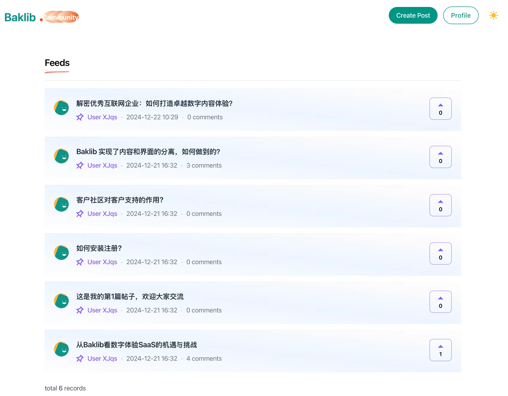
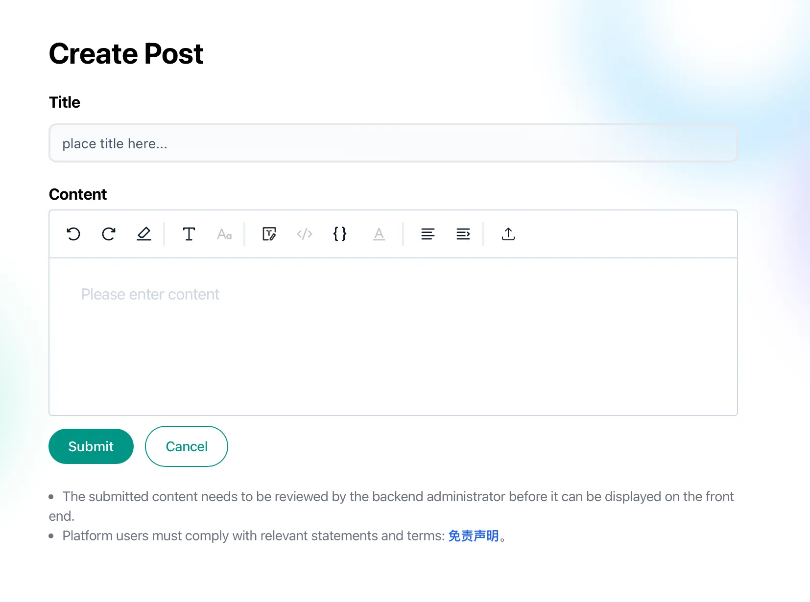

# [Baklib Community Question 模板]

A lightweight Q&A management system designed for creating and managing question-and-answer content such as FAQs, troubleshooting guides, knowledge base articles, user support threads, and more.

教程： https://help.baklib.cn/themes/community/question

Demo: https://demo-question.uibak.com/


轻量级问答管理系统，用于创建和管理问答内容，如常见问题、故障排查指南、知识库文章、用户支持帖等。
社区问答网站是一个平台，用户可以在特定主题或一系列主题上提问和回答问题。这些网站促进协作、知识共享和社区建设。它们通常包含以下功能：

* **提问:** 用户可以提交问题，提供详细信息和上下文。这通常包括标题、正文文本以及可能用于分类的标签。

* **回答:** 其他用户可以回答已提出的问题。最佳答案通常会被提问者点赞或标记为已采纳。

* **用户个人资料:** 用户通常拥有个人资料，显示他们的活动、声誉（基于点赞、已采纳的答案等）以及其他相关信息。

* **投票/点赞:** 用户可以对答案进行投票，表明其有用性或准确性。高票答案通常会更突出地显示。

* **评论:** 用户可以评论问题和答案，以提供进一步的澄清、反馈或其他信息。

* **分类/标签:** 问题和答案通常被分类或标记，以便更容易找到相关内容。这提高了可搜索性和组织性。

* **搜索功能:** 健全的搜索功能允许用户快速找到与他们的查询相关的现有问题和答案。

* **审核:** 为维护质量和防止滥用，社区问答网站通常有版主来监督内容、执行规则和处理用户问题。


## Screenshots






## 🚀 Project Structure

```
  ├── README.md
  ├── config
  │   └── settings_schema.json
  ├── layout
  │   ├── error.liquid
  │   └── theme.liquid
  ├── package-lock.json
  ├── package.json
  ├── snippets
  │   ├── _demo_forum.liquid
  │   ├── _feedback_form.liquid
  │   ├── _footer.liquid
  │   ├── _header.liquid
  │   ├── _hero.liquid
  │   ├── _news_letter.liquid
  │   ├── _page.liquid
  │   ├── _page_form.liquid
  │   ├── _reply.liquid
  │   ├── _reply_answer_form.liquid
  │   ├── _reply_page_form.liquid
  │   ├── _search_form.liquid
  │   └── _tag.liquid
  ├── statics
  │   ├── edit.liquid
  │   ├── feed.liquid
  │   ├── new.liquid
  │   ├── replies.liquid
  │   └── terms.liquid
  ├── tailwind.config.js
  ├── templates
  │   ├── create_answer_reply_success_turbo_stream.liquid
  │   ├── create_post_error_turbo_stream.liquid
  │   ├── create_reply_success_turbo_stream.liquid
  │   ├── destroy_reply_success_turbo_stream.liquid
  │   ├── index.forum.liquid
  │   ├── index.liquid
  │   ├── page.liquid
  │   ├── search.liquid
  │   ├── tag.liquid
  │   └── toast_error_turbo_stream.liquid
  └── yarn.lock
```
